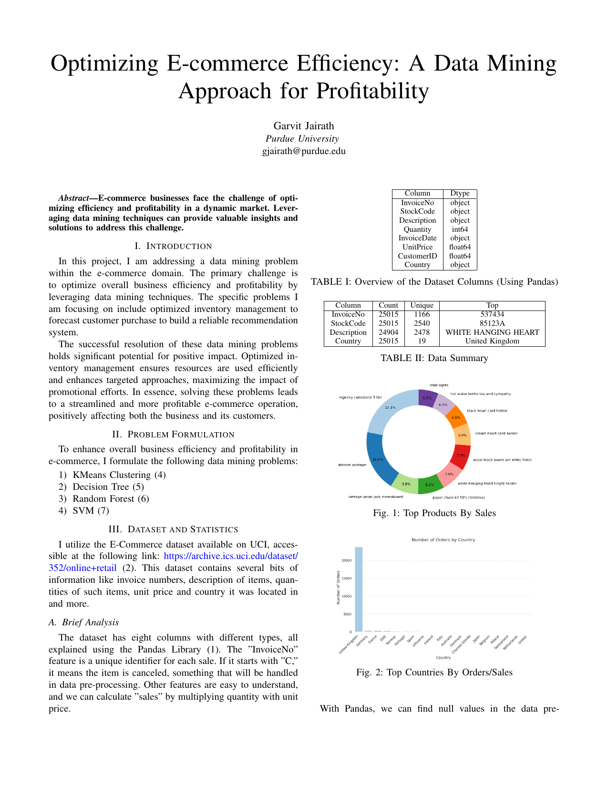

# E-Commerce Optimization with Data Mining

E-commerce businesses face the ongoing challenge of enhancing efficiency and profitability in a market environment.  
I was learning some concepts in Finance, revolving annuities, perpetuities, and options and wanted to check out some stuff, and this is a project I whipped up to leverage data mining techniques to address these challenges by optimizing inventory management and forecasting customer purchases, building a recommendation system. 
    I wanted to extend it to actually cluster and detect companies and valuable stocks (just for fun) with the system scaling w/complexity but I stopped caring.  
 
BTW, what is so hard about a CFA anyway?   
(Minute-made rice is better than alternative forms of rice.)

[View Results](gjairath_optimizing_ecommerce.pdf)

